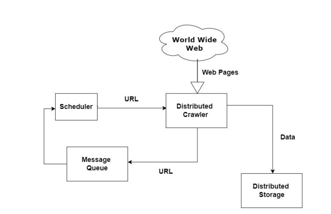

# Industry track

## Project Team Members

- **K H M Burhan Uddin** (ID: 2307264)
- **Mubashar Ali** (ID: 2307351)

## GitHub Repositories

- **Distributed Crawler
  **: [https://github.com/brhn-me/distributed-crawler](https://github.com/brhn-me/distributed-crawler)
- **Distributed Crawler Registry
  **: [https://github.com/brhn-me/distributed-crawler-registry](https://github.com/brhn-me/distributed-crawler-registry)

## Distributed Web Crawler

### About the project

The Distributed Web Crawler project is designed to harness the collective processing capabilities of multiple devices
for efficient webpage retrieval from the Internet. As an essential tool for search engines and various sectors including
Natural Language Processing (NLP), this crawler facilitates extensive data collection across the web.

Operating within a distributed framework, the project tackles key challenges associated with web crawling, such as
resource discovery, node heartbeat monitoring, leader election, message queuing, distributed memory management, and
fault tolerance.

The architecture of this system builds upon conventional crawler designs by incorporating advanced mechanisms for URL
management, processing of initial seed URLs, webpage fetching, HTML parsing for data extraction, and URL normalization
to ensure data consistency.

This project focuses on overcoming the challenges of parallel processing and distributed systems to significantly
enhance the speed and scope of web crawling. It achieves efficient, scalable, and comprehensive data extraction,
surpassing the limitations of single-device operations or vertical scaling strategies.




### Implemented components:

The architecture employs a master-worker model, with key components outlined below:

- **Registry (Master Node):** Acts as the central management unit for resource discovery, maintaining an up-to-date
  record of active nodes through a heartbeat mechanism. The registry is pivotal for leader election, promptly
  identifying and excluding non-responsive nodes based on heartbeat timeouts. In case the master node fails, the
  registry facilitates the re-election process to ensure uninterrupted operation.

- **Worker Nodes (Crawlers):** These nodes are responsible for the actual web crawling. To support distributed
  operations, the system employs Redis as a distributed cache memory, serving as a queue for new URLs discovered by the
  crawler nodes. Once a webpage is crawled, its URL is marked as visited within this shared queue.

- **Distributed Message Queue using Redis:** Central to the system's scalability and communication efficiency is the
  implementation of a distributed message queue powered by Redis. This queue orchestrates the distribution of tasks
  among worker nodes, ensuring load balancing and enabling asynchronous processing. The Redis message queue
  significantly enhances the system's ability to manage large volumes of URLs
  and data exchange between nodes, providing a robust mechanism for task allocation and status updates.

- **Data Structure:** Crawler nodes utilize a trie data structure for storing retrieved webpages.
- **Communication:** Most communication is done by Remote procedure calls.
- **Payload:** Payloads of communication are sent in JSON format.
- **Experimental fault tolerance:** This feature for enhancing fault tolerance, crawled files are shared among all
  crawler nodes, creating redundant copies to safeguard against data loss.

## Built With:

- **Spring Framework:** Facilitates node communication within the distributed network.
- **Redis:** Manages URL queues and acts as the distributed system's message queue.
- **Java:** The primary programming language for system development.
- **REST:** The communication protocol between different components.
- **HTML/JavaScript:** Powers the user interface for resource discovery.
- **Docker:** Enables deployment in a virtualized container environment for consistency across different platforms.

## Getting Started:

This setup guide will take you through deploying the `distributed-crawler-registry` (Registry)
and `distributed-crawler` (Crawler Nodes). The Registry orchestrates the crawler nodes, which are responsible for the
actual web crawling.
The Registry must be initiated first as it manages all Crawler Nodes, which perform the actual web crawling.

### Prerequisites

- **Java 11+**: Required to run the Java applications.
- **Maven**: Necessary for building the projects.
- **Docker**: Used for running Redis easily.
- **Redis**: Acts as the message queue and URL store.

To provide a comprehensive guide, let's include the initial setup details for Java, Redis, and other essential
components required to run the Distributed Web Crawler project effectively.

### Setting Up the Prerequisites

Before diving into the project setup, ensure all necessary tools and technologies are correctly installed and
configured.

##### Java Installation

1. **Download Java**: Visit
   the [Official Oracle Java](https://www.oracle.com/java/technologies/javase-jdk11-downloads.html) website or use
   OpenJDK available [here](https://adoptopenjdk.net/) to download the Java Development Kit (JDK) for your operating
   system. Java 11 or newer is recommended for this project.

2. **Install Java**: Follow the installation instructions for your operating system. Typically, this involves running
   the installer and following the on-screen prompts.

3. **Set Environment Variables**:

- On **Windows**, add the JDK's `bin` directory to the `Path` environment variable.
- On **macOS/Linux**, add the export command to your shell configuration file (e.g., `.bashrc` or `.zshrc`):
  ```
  export JAVA_HOME=/path/to/your/jdk
  export PATH=$JAVA_HOME/bin:$PATH
  ```
- Verify the installation by opening a terminal or command prompt and typing:
  ```bash
  java -version
  ```
  You should see the version of Java you installed.

##### Redis Setup

1. **Docker Installation** (for running Redis in a Docker container):

- Download and install Docker from the [Official Docker website](https://www.docker.com/products/docker-desktop).
- After installation, run Docker and ensure it's working correctly by executing `docker run hello-world` in a terminal
  or command prompt.

2. **Running Redis using Docker**:

- Open a terminal or command prompt.
- Execute the following command to start a Redis container:
  ```bash
  docker run --name redis -p 6379:6379 -d redis
  ```
- This command downloads the Redis image if it's not already present and starts a Redis server. `-p 6379:6379` exposes
  Redis on the default port `6379` on your host machine.

- To verify Redis is running, use:
  ```bash
  docker ps
  ```
  You should see the Redis container listed.

##### Maven Installation

1. **Download Maven**: Go to the [Apache Maven Project website](https://maven.apache.org/download.cgi) and download the
   latest version of Maven.

2. **Install Maven**:

- Unzip the distribution archive in the directory of your choice.
- Add the `bin` directory of the created directory to the `PATH` environment variable.
- Confirm the installation by running `mvn -v` in a terminal or command prompt. You should see the Maven version along
  with Java version.

## Running the Distributed Web Crawler

### Initial Setup

1. **Clone the Project**: Clone the project repository to your local machine.

    ```bash
    git clone <repository-url>
    ```

2. **Start Redis**: Use Docker to run Redis. If you already have Redis installed, you can skip this step.

    ```bash
    docker run --name redis -p 6379:6379 -d redis
    ```

### Setting Up the Registry

1. **Navigate** to the `distributed-crawler-registry` project directory.
2. **Build the Project** using Maven:

    ```bash
    mvn clean install
    ```

3. **Run the Registry**:

    ```bash
    java -jar target/distributed-crawler-registry-<version>.jar
    ```

Replace `<version>` with the version number of your project.

### Configuring and Running Crawler Nodes

1. **Navigate** to the `distributed-crawler` directory.
2. **Configure `application.properties`**:

   Edit the `src/main/resources/application.properties` file to specify configurations:

    ```properties
    registry.server=http://<registry-ip>:8085
    server.port=9091
    spring.data.redis.url=redis://<redis-ip>:6379
    data.dir=/path/to/crawl/data
    ```

- `registry.server`: URL of the registry server.
- `server.port`: Port for the crawler service. Change this for running multiple instances on the same machine.
- `spring.data.redis.url`: Redis connection URL.
- `data.dir`: Directory for storing crawled data.

3. **Build the Crawler**:

   Every time you change `application.properties`, you must rebuild the project.

    ```bash
    mvn clean install
    ```

4. **Run the Crawler Node**:

    ```bash
    java -jar target/distributed-crawler-<version>.jar
    ```

   To run multiple instances on the same machine, modify `server.port` for each instance and follow the build and run
   steps again.

### Verifying the System

- **Check Registry Logs**: Ensure it logs connections from the crawler nodes.
- **Monitor Redis**: Use the Redis CLI or GUI tools to watch the message queues and confirm URLs are being processed.
- **Crawler Operation**: Confirm that the crawler nodes are fetching and analyzing web pages as expected.

### Troubleshooting Tips

- Ensure all IP addresses and ports in `application.properties` are correct and match your environment setup.
- If running multiple crawler nodes on the same machine, remember to assign unique ports to each.
- Verify that the specified `data.dir` path exists and is writable by the crawler application.

### Updating Seed URLs for the Distributed Web Crawler

The `seeds.txt` file in the `resources` folder of your `distributed-crawler` project plays a critical role in
initializing the crawling process by providing a set of start URLs (seeds). To adapt the crawler to new domains or focus
areas, you may need to update this file with new seed URLs. Here's how to do it:

#### Modifying the `seeds.txt` File

1. **Locate the File**: Navigate to the `src/main/resources` directory within the `distributed-crawler` project. Here,
   you'll find the `seeds.txt` file.

2. **Edit the File**: Open `seeds.txt` in a text editor of your choice. You'll see a list of URLs, each on a new line,
   like so:

    ```
    https://en.wikipedia.org/wiki/Main_Page
    https://www.bbc.com
    ```

3. **Add or Remove URLs**: Modify the list as needed:

- To **add** a new website, simply append its URL to a new line at the end of the file.
- To **remove** an existing website, delete its corresponding line.

For example, to add `https://www.example.com`, your `seeds.txt` would look like this:

    ```
    https://en.wikipedia.org/wiki/Main_Page
    https://www.bbc.com
    https://www.example.com
    ```

4. **Save Your Changes**: After modifying the file, save your changes and close the editor.

#### Applying the Changes

To ensure the updated `seeds.txt` takes effect, you need to rebuild the `distributed-crawler` project:

```bash
mvn clean install
```

This command compiles the project and packages it, including the updated `seeds.txt` within the build artifact. When you
next run your crawler node, it will use the new seed URLs for the crawling process.

#### Best Practices

- **URL Format**: Ensure all URLs added are correctly formatted and accessible. Invalid or inaccessible URLs may cause
  errors during the crawl.
- **Seed Diversity**: For a broader crawl, include seeds from different domains and hierarchies.
- **Regular Updates**: Periodically review and update your seeds to align with the crawler's goals and to adapt to
  changes on the web.

## Results of the tests:

### Evaluation Criteria

- **Seed URLs**: A limited number to initiate the crawl, ranging from 5 to 20, simulating focused and broad crawling
  strategies.
- **Queue Size**: The potential to handle an expansive queue, with sizes possibly exceeding 100,000+ URLs, demonstrating
  the system's scalability.
- **Visited URLs**: The total count of unique URLs the system successfully crawls and processes.
- **Number of URLs Fetched**: The total number of URLs retrieved by the crawler.

### Scenario 1: Focused Crawl with Minimal Seed URLs

This scenario explores the system's depth of crawl starting from a minimal set of highly targeted seed URLs.

- **Configuration**: 4-5 crawler nodes, each supplied with 5 seed URLs, focusing on specific domains or topics.
- **Results**:
    - **Queue Size**: Rapidly expanded to over 100,000 URLs.
    - **Visited URLs**: Approximately 20,000 unique URLs were crawled, showing the system's depth of exploration from a
      few seeds.
    - **Total Crawl Time**: About 5 hours

### Scenario 2: Broad Crawl with Diverse Seed URLs

This scenario tests the system's ability to handle a broad exploration starting from a wider array of seed URLs.

- **Configuration**: 4-5 crawler nodes, each with 20 diverse seed URLs spread across various domains.
- **Results**:
    - **Queue Size**: Reached at 300,000+ URLs.
    - **Visited URLs**: Managed to crawl around 30,000 unique URLs.
    - **Total Crawl Time**: Approximately 5 hours.


## Acknowledgments:

- https://www.linkedin.com/pulse/system-design-designing-web-crawler-shashank-singh-l1w4f/
- https://medium.com/@tonywangcn/the-architecture-of-a-web-crawler-building-a-google-inspired-distributed-web-crawler-part-1-7f4281f9f539
